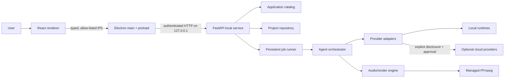

# System Overview

## Context

Cinematic Story Studio is a local-first Windows application with a least-privilege desktop UI, an authenticated loopback service, durable project storage, isolated provider/tool adapters, and controlled runtime production agents.

The renderer is untrusted presentation code. Electron main owns native dialogs, the service process, the launch token, and the narrow IPC bridge. FastAPI is the only writer to project state. Agents, providers, and render code use application interfaces rather than accessing the renderer, SQLite, or credentials directly.

## Components and responsibilities

| Component | Responsibility | Must not |
| --- | --- | --- |
| Electron main | Window lifecycle, native file selection, service supervision/authentication, secure credential bridge, authenticated HTTP client | Parse stories, write SQLite, expose secrets to renderer |
| Preload bridge | Versioned, allow-listed request/event IPC with runtime validation | Expose Node primitives or generic IPC/filesystem methods |
| React renderer | Accessible project, review, jobs, provider, and diagnostics UI | Read local paths, spawn processes, call the service directly |
| FastAPI service | Validate API contracts, authorize requests, coordinate transactions/use cases | Bind LAN interfaces, execute shell strings, embed provider behavior |
| Project repository | Typed persistence, revisions, migrations, provenance, artifact references | Store provider secret values or overwrite immutable source |
| Persistent job runner | Leasing, progress/events, checkpoints, cancellation, retry/resume | Treat memory state as authoritative or publish partial output |
| Agent orchestrator | Versioned DAG, approval gates, protected human corrections | Run open-ended autonomous loops or bypass gates |
| Provider adapters | Capability/health/invocation normalization, metadata, cancellation | Choose policy, log content, obtain credentials from SQLite |
| Audio/render engine | Deterministic manifest/timeline, safe tool invocation, validation, atomic publication | Mutate approved inputs or claim success before QC |

## Typed boundaries

- The service owns canonical Pydantic/domain models and publishes versioned JSON Schema/OpenAPI.
- TypeScript contracts are generated or validated against that source and wrapped by a typed desktop client. CI fails on uncommitted contract drift.
- Persistence maps domain types explicitly; ORM objects never cross the API boundary.
- IPC is a small versioned command/event union. Payloads are runtime-validated on both sides.
- Provider, agent, job, storage, and render interfaces use typed request/result envelopes with explicit errors, warnings, provenance, cancellation, and versions.
- Identifiers are opaque UUID-compatible strings; timestamps are UTC RFC 3339; durations/timeline positions are integer samples or integer milliseconds as declared—never untyped floats.
- Unknown fields are rejected on mutation requests. Additive response fields require a compatible contract version; breaking changes require a new API/schema version and migration.

## Primary data flow

1. Electron streams a user-selected source to `POST /api/v1/projects/{id}/imports`.
2. The service validates into private staging, hashes raw bytes, and commits immutable `SourceDocument` and `ImportedStory` records.
3. A persisted `analyze_story` job snapshots the story/project revisions.
4. Versioned runtime agents derive structure, dialogue, and characters, writing revisioned projections and provenance transactionally at checkpoints.
5. The UI reviews those projections. Human edits append correction events and update protected projections with optimistic concurrency.
6. Approval decisions pin artifact revisions. A future render job resolves them into a deterministic manifest, invokes providers/tools through adapters, validates output, and atomically publishes artifacts.

## Persistence topology

The canonical packaged topology is:

- an application catalog under the app data root for preferences, last-project pointer, provider configuration metadata, and project locations;
- one self-contained project directory per project, with a project SQLite database plus private `sources`, `artifacts`, `cache`, `staging`, and `backups` subdirectories.

For the Phase 0 vertical slice, one application-level SQLite database containing all logical projects is acceptable if every project-owned table has enforced `project_id`, all access goes through the `ProjectRepository` interface, application-managed files remain project-scoped, deletion is tested, and the implementation records a migration path. API and domain contracts do not expose physical database topology.

## Architectural invariants

1. The application starts and supports core Phase 0 work without cloud services, Docker, or provider credentials.
2. Only the local service writes project state.
3. Original sources, human corrections, approvals, job attempt history, and published manifests are immutable or append-only; current views are projections.
4. Every asynchronous result identifies input revision, producer/version, provider/model when applicable, configuration/hash, warnings, and confidence where meaningful.
5. Every external process is invoked with a validated executable and argument array, a private working directory, bounded resources/time, and captured redacted output.
6. Network listeners are loopback-only and authenticated. Cloud transmission requires a recorded user decision.
7. Temporary outputs become durable only through validation plus atomic rename/transaction.
8. Stable ordering and canonical serialization determine manifest identity; wall-clock metadata is excluded from content identity.

## Repository boundaries

- `apps/desktop`: Electron main/preload/renderer.
- `apps/local-service`: FastAPI composition root and process entry point.
- `packages/contracts`: versioned shared contract artifacts and generated TypeScript types.
- Python service modules/packages: domain use cases and adapters for storage, import, analysis, jobs, providers, agents, audio, and rendering.
- `fixtures`: synthetic public test content only.
- `prototypes/v3-reference`: sanitized historical reference, never imported as production architecture.

Dependency direction is UI → client contract → service use case → domain ports → infrastructure adapters. Infrastructure may implement domain ports; domain code must not import Electron, FastAPI, SQLAlchemy, a concrete provider SDK, or FFmpeg process details.

## Related documents

- Desktop/service lifecycle: [desktop-runtime.md](desktop-runtime.md), [local-service.md](local-service.md)
- Storage and work: [project-data-model.md](project-data-model.md), [background-jobs.md](background-jobs.md)
- Production: [runtime-agent-system.md](runtime-agent-system.md), [provider-adapters.md](provider-adapters.md), [audio-render-pipeline.md](audio-render-pipeline.md)
- Operations: [security-and-privacy.md](security-and-privacy.md), [failure-recovery.md](failure-recovery.md), [windows-packaging.md](windows-packaging.md)
