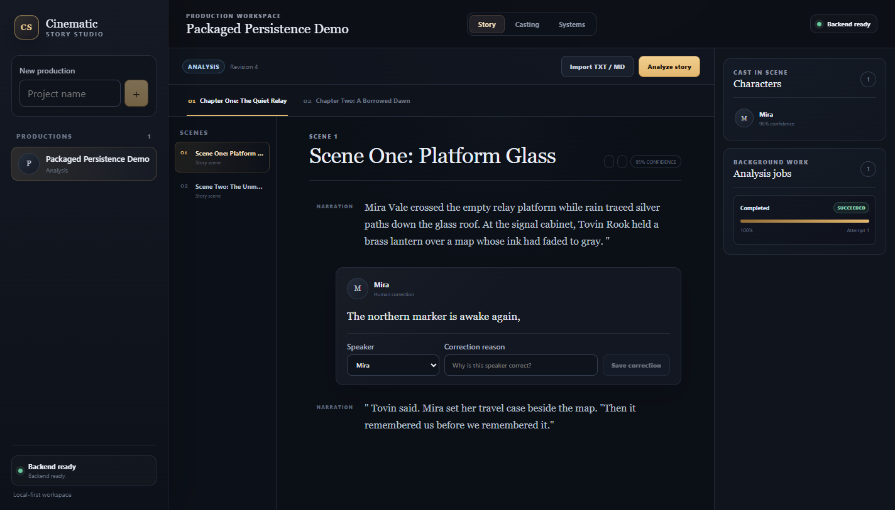

# Phase 0 verification evidence

Phase 0 was verified on Windows on 2026-07-29. Every exercised project and screenshot uses only
`fixtures/synthetic-story/sample-story.md`; no private manuscript, credential, generated audio,
model, local database, or user project was used.

Local workstation results and GitHub Actions results are separate evidence sets. A local binary
hash does not attest to a GitHub-produced binary. CI-generated binaries, screenshots, process
records, and build manifests are short-lived workflow artifacts and are not committed.

## Locally executed checks

The local checks used Node.js 24.14, pnpm 11.9.0, Python 3.14.6, and an explicitly configured local
FFmpeg installation.

| Local gate | Local result |
| --- | --- |
| `pnpm install --frozen-lockfile` | Passed with the pnpm lock and hash-enforced Python requirements |
| `pnpm lint` | Passed ESLint, Ruff, repository policy, helper syntax, and diff checks |
| `pnpm typecheck` | Passed TypeScript and strict mypy across 16 service source files |
| Repository, schema, and build-evidence tooling tests | 17 passed: 13 baseline checks plus 4 manifest checks |
| Local-service tests | 73 passed, 0 skipped, 1 upstream Starlette TestClient warning |
| Desktop component/unit tests | 21 passed across 4 files |
| Windows CPython 3.12 lock simulation | Every pinned wheel and hash resolved |
| PyInstaller and unpackaged Electron build | Passed |

The local-service total is 73 passed because the managed FFmpeg executable was present and the
executable loudness test ran. It must not be quoted as a GitHub Actions result.

## GitHub Actions checks

The hosted Windows workflow uses Node.js 24, pnpm 11.9.0, and Python 3.12. It runs frozen
installation, lint, type checks, repository/schema tests, local-service tests, desktop tests, the
PyInstaller and unpackaged Electron build, the exact-artifact packaged E2E gate, a tracked-content
rescan, a clean-tree check, build-evidence generation, and short-lived artifact upload.

| GitHub Actions gate | Hosted Windows result semantics |
| --- | --- |
| Repository, schema, and build-evidence tooling tests | 17 passed: 13 baseline checks plus 4 manifest checks |
| Local-service tests | 72 passed, 1 FFmpeg-dependent test skipped, 1 upstream Starlette TestClient warning |
| Desktop component/unit tests | 21 passed across 4 files |
| FFmpeg-dependent executable loudness test | Skipped because CI does not configure an explicit managed FFmpeg path |
| Build | Produces the staged service and unpackaged desktop on that runner |
| Exact-artifact packaged E2E | Runs after `pnpm build` against that run's executable and embedded service |
| Repository protections | Re-scan and clean-tree verification must pass |

The per-run build-evidence manifest is the authoritative record for the workflow/tested-checkout
SHA, pull-request head SHA when applicable, application version, repository-relative artifact
paths, byte sizes, SHA-256 values, staged-versus-embedded service equality, packaged-E2E outcome,
runner identity, test timestamp, and owned-process termination evidence. This avoids treating a
locally produced PyInstaller binary as evidence for the environment-specific CI binary.

## FFmpeg-dependent checks

The shell-free capability probe and executable loudness test require an explicit managed FFmpeg
path. Locally, they detected `8.1.2-full_build-www.gyan.dev` with decode and PCM-WAV encode
capabilities and passed. GitHub Actions does not silently select an executable from the hosted
runner image, so that one test remains an explicit skip there. All non-executable audio-QC tests run
in both environments.

## Development Electron E2E

The development Electron E2E was executed locally. It launched the development desktop and owned
Python service, created a project, imported and analyzed the synthetic fixture, saved a human
speaker correction, restarted the application, and restored the correction. The GitHub Windows
workflow does not claim or run this development E2E.

## Locally built packaged E2E

The packaged E2E was executed locally against the locally produced unpackaged application. It used
isolated `APPDATA`, `LOCALAPPDATA`, `TEMP`, and `TMP` directories, completed the create/import/
analyze/correct/close/restart/restore/close flow, and captured the committed synthetic screenshot.
This proves the local build only.

## Exact CI-artifact packaged E2E

After `pnpm build`, GitHub Actions resolves
`apps/desktop/release/<version>/win-unpacked/Cinematic Story Studio.exe` and passes that exact path
to the committed packaged persistence test. The test uses only the synthetic fixture and isolated
application and temporary directories.

For each launch, the gate records relevant preexisting process state, establishes ownership from
the exact test-created Electron process tree, identifies the embedded
`cinematic-story-service.exe`, and records only those owned Electron and service PIDs. After each
shutdown it must prove those exact PIDs are absent. It fails without terminating an unrelated
process if ownership cannot be established. The resulting process evidence feeds the per-run build
manifest uploaded beside the unpackaged artifact.

## Dependency-audit evidence

GitHub CI uses the repository's dependency-review workflow to review dependency changes and fail at
the configured severity threshold. The following full-lock vulnerability audits were executed
locally and are not claimed as GitHub Actions gates:

- `pnpm audit --audit-level high` checked the pnpm lock against the registry advisory service and
  reported no known vulnerabilities at or above the threshold.
- `pip-audit` 2.10.1, run from a temporary external environment with `--require-hashes` and
  `--disable-pip`, checked `apps/local-service/requirements.lock` and reported no known
  vulnerabilities.

No downloader or additional mutable security tool is introduced by the Windows build workflow.

## Other local capability probes

- The development-only, fixed-loopback Kokoro `/health` probe reported available. No story content
  was sent.
- Cloud language and speech adapters stayed disabled, and the application performed no cloud
  content submission.

## Packaged UI

The committed screenshot is local packaged-E2E evidence, not CI-artifact evidence. Generated build
output, staged services, CI manifests, and CI screenshots remain ignored and uncommitted.
